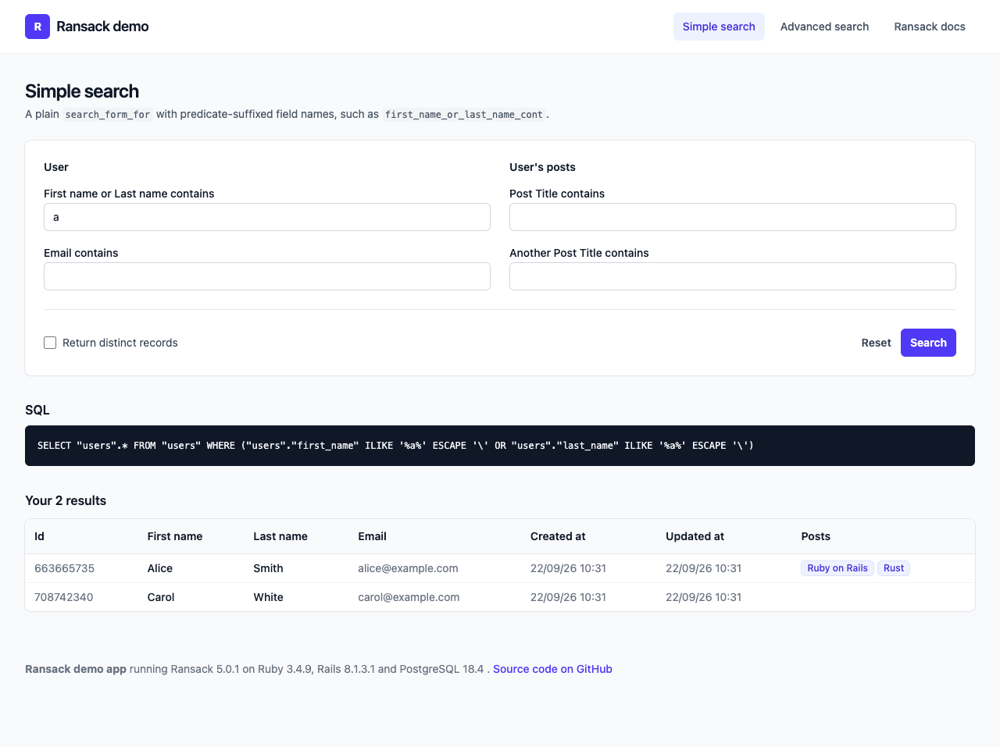
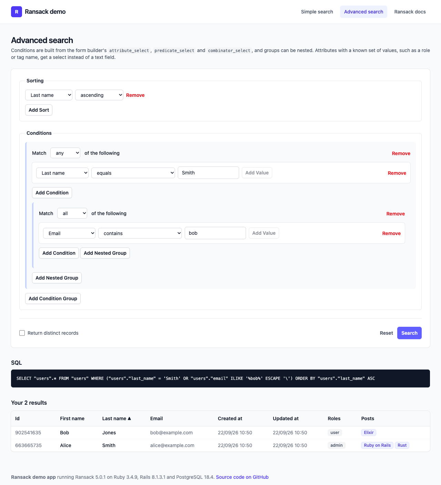

# Ransack Demo Application

A small Rails 8 application showing how to use
[Ransack](https://github.com/activerecord-hackery/ransack) for both a simple
search form and an "advanced" search form with nested condition groups. It runs
at https://ransack-demo.herokuapp.com.





## What it demonstrates

Every field on the simple search page carries a caption naming the ransack
feature behind it. The map, by file:

| Feature | Where |
| --- | --- |
| `search_form_for` with predicate-suffixed fields (`name_cont`, `email_cont`, `posts_title_cont`) | `app/views/users/index.erb` |
| `ransack_alias :name, :first_name_or_last_name` | `app/models/user.rb` |
| Searching through associations, one and two levels deep (`roles_name_in`, `posts_tags_name_in`) | `app/models/user.rb`, `app/models/post.rb` |
| A `ransacker` over a concatenation (`full_name`) and one over a `COUNT` subquery (`posts_count`), used to filter and to sort | `app/models/user.rb` |
| `ransackable_scopes`: conditions that must hold across *different* posts (`with_post_titled`, `without_post_titled`) | `app/models/user.rb` |
| A custom predicate, `lteq_end_of_day`, for inclusive date ranges | `config/initializers/ransack.rb` |
| Allowlisting with `ransackable_attributes`, `ransortable_attributes`, `ransackable_associations` and `ransackable_scopes` | every model |
| `sort_link` in table headers, including on a ransacker | `app/views/users/_results.erb` |
| `result(distinct: true)` and the PostgreSQL `SELECT DISTINCT` / `ORDER BY` rule it runs into | `app/models/user.rb` (`with_posts_count`) |
| Advanced search: `attribute_select`, `predicate_select`, `combinator_select`, `sort_select`, nested `grouping_fields` | `app/views/users/advanced_search.erb` and partials |
| Selects instead of text fields for attributes with a known set of values | `app/helpers/users_helper.rb` (`value_options`) |
| Which predicates accept several values (`in`, `not_in`, `_any`, `_all`) | `app/helpers/application_helper.rb` (`multi_value_predicates`) |
| The generated SQL for every search, printed under the form | `app/views/users/_results.erb` |

Two questions from the issue tracker are answered in the model tests,
`test/models/user_test.rb`:

- *Users who have a post titled A and a post titled B* (#6): two conditions in
  one search apply to the same joined row, so use scopes, each with its own
  subquery.
- *How many of a user's posts matched the search* (#2):
  `search.result.group("users.id").count`, because a non-distinct result has one
  row per matching post.

## How the advanced form works

- `app/helpers/application_helper.rb` renders each set of fields (sort,
  condition, value, grouping) once into a `<template>` next to its button
  (`button_to_add_fields`). Groupings can contain groupings, which Ruby cannot
  render recursively, so `grouping_template` renders the group fields once under
  the placeholder object name `new_object_name`.
- `app/javascript/controllers/search_controller.js` is a Stimulus controller that
  clones those templates, stamps a unique index into the placeholder
  (`new_condition`, `new_value`, ...), and re-parents the grouping template on
  each nest. It also keeps the value field in step with the chosen attribute and
  predicate.

The UI is [Tailwind CSS](https://tailwindcss.com) via `tailwindcss-rails`, with
JavaScript served through import maps; there is no Node toolchain.

## Running locally

```sh
bin/setup               # bundle, create and seed the PostgreSQL database, start the server
bin/rails test          # unit and integration tests
bin/rails test:system   # browser tests of the dynamic form (needs Chrome)
```

## Deploying

Every push to `main` that passes CI is shipped to Heroku by the `deploy` job in
`.github/workflows/ci.yml`. The job needs a repository secret named
`HEROKU_API_KEY` (a token from `heroku authorizations:create`), and reads the
app name from an optional `HEROKU_APP_NAME` repository variable, defaulting to
`ransack-demo`. A hand-run deploy is just `git push heroku main`.
